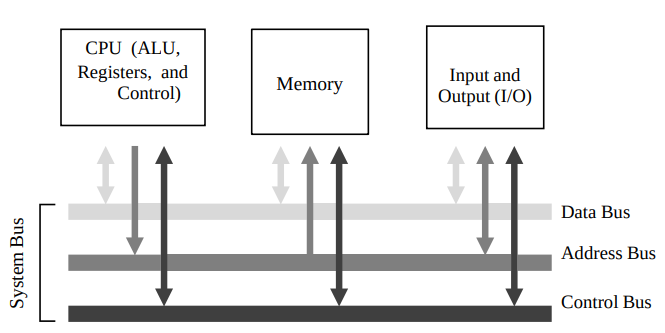

## Lecture 1

    
Computer Architecture

    is teh study of building entire computer systems.

    
How many point of view do we have regarding computer hardware?

    1. Computer Organization  
    2. Computer Design  
    3. Computer Architecture  

    
Computer Organization

    deals with <b style="color: red">structural relationships</b> that are <b style="color: red">not visible to the programmer</b>

    
Computer Design

    Hardware Design/Implementation

    
Computer Architecture

    deals with the <b style="color: red">functional behavior</b> of a computer as <b style="color: red">viewed by a programmer</b>

    
Computer Organization

    deals with **structural relationships** that are **not visible to the programmer**

 

## Lecture 2

    
Computer

    is an advanced electornic device that takes raw data as input and processes these data under a set of instructions and gives the output and saves the output.

    
How many functions does a computer have and what are they?

    1. accept data: Input  
    2. process data: Processing  
    3. produces output: Output  
    4. stores results: Storage  

    
how many entities digital computer system is divided into?

    1. software  
    2. hardware  

    
Software system

    Operating system, application programs, programming languages.

    
Hardware system

    printer, mouse, keyboard, .., etc.

    
what are the steps of instructing a computer?

    1. write a program  
    2. compile it  
    3. execute it  

    
how many components does Von Neumann consist?

    1. input unit  
    2. output unit  
    3. arithmetic logic unit  
    4. memory unit  
    5. control unit  

    
The System Bus Model

    It is a refinement of the von Neumann model which has a CPU, memory and IO unit.

    
draw image/diagram of System Bus Model

    

    
What system bus is made up of?

    1. data bus  
    2. address bus  
    3. control bus  

    
ISA

    it is the semantics of all instructions supported by a processor.

    
What features an ISA must contain?

    1. Complete  
    2. Concise  
    3. Generic  
    4. Simple  

    
Concise in ISA

    The instruction set should have a limited size 32 - 1000 instructions.

    
Generic in ISA

    Instructions should not be too specialized

    
Simple

    should not be very compliated

    
How many ISA paradigms do we have?

    1. RISC  
    2. CISC  

    
RISC

    Implements simple instructions that have a simple regular structure.

    
CISC

    implements complex instructions that are highly irregular, take multiple operands.

 

## Abbrevations

    
ALU

    Arithmetic and Logic Unit

    
I/O

    Input and Output

    
ISA

    instruction set architecture

    
RISC

    Reduced instruction set computer

    
CISC

    Complex instructions set computer

